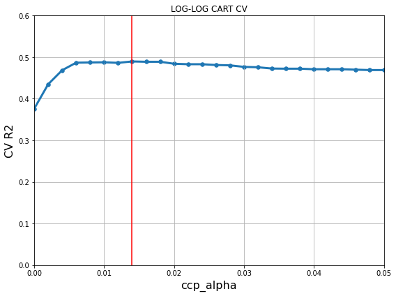
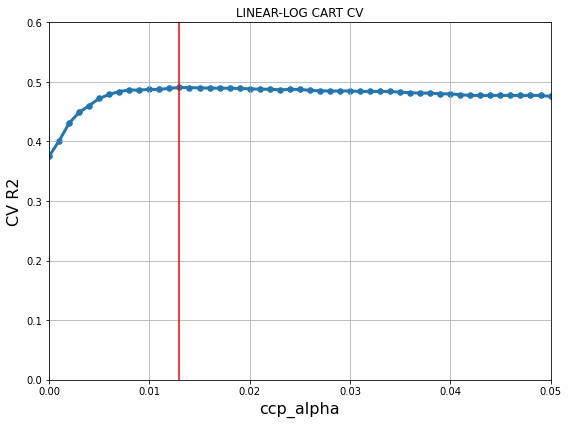
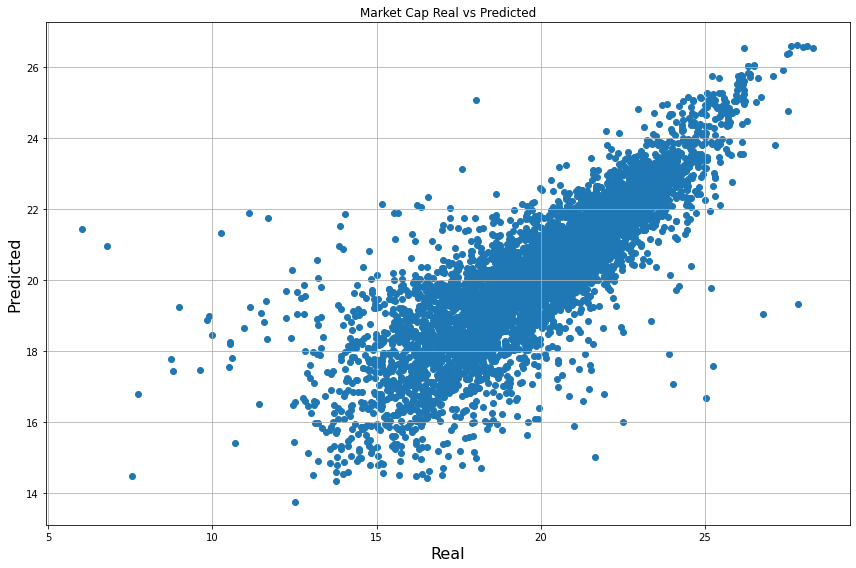
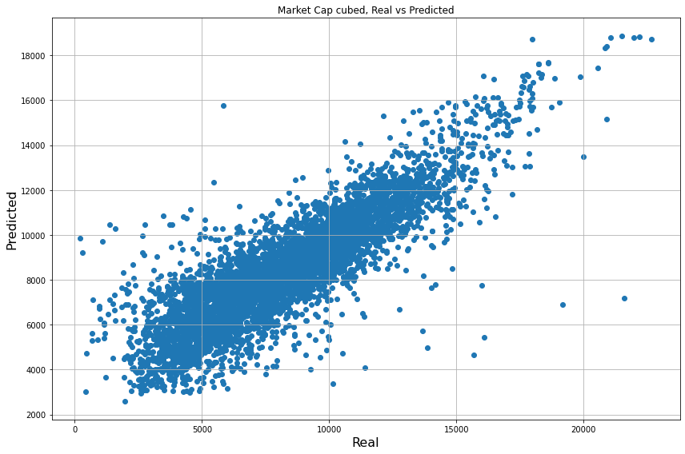
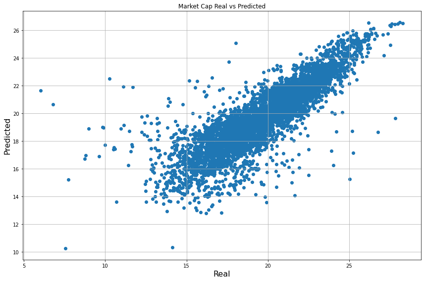
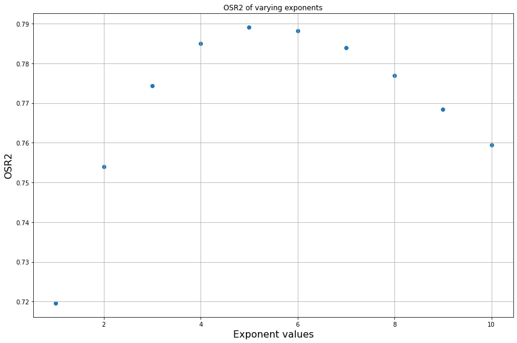
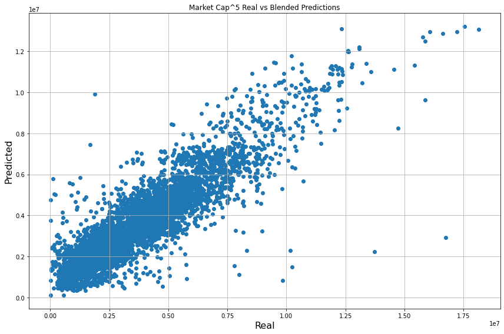

# Initialization 


```python
import pandas as pd
import numpy as np
import matplotlib.pyplot as plt


##### IMPORT ALL USED LIBRARIES HERE TO AVOID REDUNDANCY

### Random Forests ###
from sklearn.model_selection import train_test_split
from sklearn.ensemble import RandomForestRegressor

### Linear Regression ###
import statsmodels.formula.api as smf
import statsmodels.api as sm
from statsmodels.stats.outliers_influence import variance_inflation_factor
from sklearn.linear_model import LinearRegression

### CART ###
from sklearn.tree import DecisionTreeRegressor
from sklearn.model_selection import GridSearchCV
from sklearn.model_selection import KFold
```

    /usr/local/lib/python3.7/dist-packages/statsmodels/tools/_testing.py:19: FutureWarning: pandas.util.testing is deprecated. Use the functions in the public API at pandas.testing instead.
      import pandas.util.testing as tm
    


```python
def OSR2(model, X_test, y_test, y_train):
    y_pred = model.predict(X_test)
    SSE = np.sum((y_test - y_pred)**2)
    SST = np.sum((y_test - np.mean(y_train))**2)
    return (1 - SSE/SST)

def OSR2_no_model(y_pred, y_test, y_train):
    SSE = np.sum((y_test - y_pred)**2)
    SST = np.sum((y_test - np.mean(y_train))**2)
    return (1 - SSE/SST)

def MSE(model, X_test, y_test, y_train):
    y_pred = model.predict(X_test)
    mse = np.mean((y_test-y_pred)**2)
    return mse

def MSE_no_model(y_pred, y_test):
    mse = np.mean((y_test-y_pred)**2)
    return mse

def MAE(model, X_test, y_test, y_train):
    y_pred = model.predict(X_test)
    mae = np.mean(np.abs(y_test-y_pred))
    return mae

def MAE_no_model(y_pred, y_test):
    mae = np.mean(np.abs(y_test-y_pred))
    return mae

def VIF(df, columns):
    values = sm.add_constant(df[columns]).values
    num_columns = len(columns)+1
    vif = [variance_inflation_factor(values, i) for i in range(num_columns)]
    return pd.Series(vif[1:], index=columns)

# adapted from StackOverflow
# https://stackoverflow.com/questions/62490392/how-to-apply-log-on-negative-values-based-upon-some-conditions-in-python
def findlog(n):
    if n > 0:
        log = np.log(n)
    elif n < 0:
        log = -np.log(-n)
    elif n == 0:
        log = 0
    return log
```

# Data Loading


```python
# reads data and removes whitespace from column names

data_filename = "clean_data.csv"
data = pd.read_csv(data_filename)
data = data.rename(columns={col:col.replace(' ', '') for col in data.columns}) # removes whitespace from column names
data
```


<div>
<style scoped>
    .dataframe tbody tr th:only-of-type {
        vertical-align: middle;
    }

    .dataframe tbody tr th {
        vertical-align: top;
    }

    .dataframe thead th {
        text-align: right;
    }
</style>
<table border="1" class="dataframe">
  <thead>
    <tr style="text-align: right;">
      <th></th>
      <th>Accession#</th>
      <th>DataDate</th>
      <th>CIK</th>
      <th>Company</th>
      <th>FiscalYear</th>
      <th>Ticker</th>
      <th>TotalAssets</th>
      <th>ShortTermAssets</th>
      <th>TotalLiabilities&amp;StockholderEquity</th>
      <th>ShortTermLiabilities</th>
      <th>NetIncome</th>
      <th>OutstandingShares</th>
      <th>MarketPrice(Monthavg.)</th>
      <th>MarketCap</th>
    </tr>
  </thead>
  <tbody>
    <tr>
      <th>0</th>
      <td>0000950123-09-057827</td>
      <td>2009-09-30</td>
      <td>804328</td>
      <td>QUALCOMM INC/DE</td>
      <td>2009</td>
      <td>QCOM</td>
      <td>27445000000</td>
      <td>12570000000</td>
      <td>27445000000</td>
      <td>2813000000</td>
      <td>1592000000</td>
      <td>1669000000</td>
      <td>33.51</td>
      <td>55928190000</td>
    </tr>
    <tr>
      <th>1</th>
      <td>0000950123-09-063897</td>
      <td>2009-09-30</td>
      <td>1024478</td>
      <td>ROCKWELL AUTOMATION INC</td>
      <td>2009</td>
      <td>ROK</td>
      <td>4305700000</td>
      <td>2134800000</td>
      <td>4305700000</td>
      <td>947200000</td>
      <td>220700000</td>
      <td>141600000</td>
      <td>33.31</td>
      <td>4716696000</td>
    </tr>
    <tr>
      <th>2</th>
      <td>0000950123-09-064772</td>
      <td>2009-09-30</td>
      <td>829224</td>
      <td>STARBUCKS CORP</td>
      <td>2009</td>
      <td>SBUX</td>
      <td>5576800000</td>
      <td>2035800000</td>
      <td>5576800000</td>
      <td>1581000000</td>
      <td>390800000</td>
      <td>742900000</td>
      <td>8.24</td>
      <td>6121496000</td>
    </tr>
    <tr>
      <th>3</th>
      <td>0000950123-09-066012</td>
      <td>2009-09-30</td>
      <td>1140859</td>
      <td>AMERISOURCEBERGEN CORP</td>
      <td>2009</td>
      <td>ABC</td>
      <td>13572740000</td>
      <td>9953753000</td>
      <td>13572740000</td>
      <td>9479610000</td>
      <td>503397000</td>
      <td>287922263</td>
      <td>18.11</td>
      <td>5214272182</td>
    </tr>
    <tr>
      <th>4</th>
      <td>0000950123-09-066095</td>
      <td>2009-09-30</td>
      <td>2969</td>
      <td>AIR PRODUCTS &amp; CHEMICALS INC /DE/</td>
      <td>2009</td>
      <td>APD</td>
      <td>13029100000</td>
      <td>2997800000</td>
      <td>13029100000</td>
      <td>2503600000</td>
      <td>631300000</td>
      <td>209900000</td>
      <td>52.88</td>
      <td>11099512000</td>
    </tr>
    <tr>
      <th>...</th>
      <td>...</td>
      <td>...</td>
      <td>...</td>
      <td>...</td>
      <td>...</td>
      <td>...</td>
      <td>...</td>
      <td>...</td>
      <td>...</td>
      <td>...</td>
      <td>...</td>
      <td>...</td>
      <td>...</td>
      <td>...</td>
    </tr>
    <tr>
      <th>23421</th>
      <td>0001819790-21-000010</td>
      <td>2020-12-31</td>
      <td>1819790</td>
      <td>TARSUS PHARMACEUTICALS, INC.</td>
      <td>2020</td>
      <td>TARS</td>
      <td>171972000</td>
      <td>170655000</td>
      <td>171972000</td>
      <td>5387000</td>
      <td>-26811000</td>
      <td>20323201</td>
      <td>36.89</td>
      <td>749722884</td>
    </tr>
    <tr>
      <th>23422</th>
      <td>0001820721-21-000009</td>
      <td>2020-12-31</td>
      <td>1820721</td>
      <td>ARRAY TECHNOLOGIES, INC.</td>
      <td>2020</td>
      <td>ARRY</td>
      <td>656024000</td>
      <td>375175000</td>
      <td>656024000</td>
      <td>289103000</td>
      <td>59073000</td>
      <td>121467000</td>
      <td>39.89</td>
      <td>4845318630</td>
    </tr>
    <tr>
      <th>23423</th>
      <td>0001829126-21-001412</td>
      <td>2020-12-31</td>
      <td>1341766</td>
      <td>CELSIUS HOLDINGS, INC.</td>
      <td>2020</td>
      <td>CELH</td>
      <td>131289773</td>
      <td>93150665</td>
      <td>131289773</td>
      <td>26365092</td>
      <td>8523849</td>
      <td>72262829</td>
      <td>39.22</td>
      <td>2834148153</td>
    </tr>
    <tr>
      <th>23424</th>
      <td>0001829126-21-001487</td>
      <td>2020-11-30</td>
      <td>1813603</td>
      <td>HESTIA INSIGHT INC.</td>
      <td>2020</td>
      <td>HSTA</td>
      <td>12110718</td>
      <td>12088765</td>
      <td>12110718</td>
      <td>24730</td>
      <td>11524462</td>
      <td>27910200</td>
      <td>9.00</td>
      <td>251191800</td>
    </tr>
    <tr>
      <th>23425</th>
      <td>0001829126-21-002058</td>
      <td>2020-12-31</td>
      <td>1421204</td>
      <td>INSPYR THERAPEUTICS, INC.</td>
      <td>2020</td>
      <td>NSPX</td>
      <td>404000</td>
      <td>404000</td>
      <td>404000</td>
      <td>12907000</td>
      <td>-6295000</td>
      <td>185625000</td>
      <td>0.01</td>
      <td>1856250</td>
    </tr>
  </tbody>
</table>
<p>23426 rows × 14 columns</p>
</div>


# Creation of Log Data


```python
#creates logdata DataFrame

logdata = pd.DataFrame()
log_columns = ['MarketCap', 'TotalAssets', 'ShortTermAssets', 'TotalLiabilities&StockholderEquity', 'ShortTermLiabilities', 'NetIncome']
for col in log_columns:
  logdata[col] = data[col].apply(findlog) # data appears exponential therefore decided natural log was best for linear estimation

#need this for train/test split
logdata['FiscalYear'] = data['FiscalYear']
logdata
```


<div>
<style scoped>
    .dataframe tbody tr th:only-of-type {
        vertical-align: middle;
    }

    .dataframe tbody tr th {
        vertical-align: top;
    }

    .dataframe thead th {
        text-align: right;
    }
</style>
<table border="1" class="dataframe">
  <thead>
    <tr style="text-align: right;">
      <th></th>
      <th>MarketCap</th>
      <th>TotalAssets</th>
      <th>ShortTermAssets</th>
      <th>TotalLiabilities&amp;StockholderEquity</th>
      <th>ShortTermLiabilities</th>
      <th>NetIncome</th>
      <th>FiscalYear</th>
    </tr>
  </thead>
  <tbody>
    <tr>
      <th>0</th>
      <td>24.747334</td>
      <td>24.035450</td>
      <td>23.254579</td>
      <td>24.035450</td>
      <td>21.757517</td>
      <td>21.188257</td>
      <td>2009</td>
    </tr>
    <tr>
      <th>1</th>
      <td>22.274374</td>
      <td>22.183206</td>
      <td>21.481639</td>
      <td>22.183206</td>
      <td>20.669021</td>
      <td>19.212315</td>
      <td>2009</td>
    </tr>
    <tr>
      <th>2</th>
      <td>22.535072</td>
      <td>22.441881</td>
      <td>21.434155</td>
      <td>22.441881</td>
      <td>21.181323</td>
      <td>19.783706</td>
      <td>2009</td>
    </tr>
    <tr>
      <th>3</th>
      <td>22.374665</td>
      <td>23.331329</td>
      <td>23.021216</td>
      <td>23.331329</td>
      <td>22.972409</td>
      <td>20.036890</td>
      <td>2009</td>
    </tr>
    <tr>
      <th>4</th>
      <td>23.130167</td>
      <td>23.290451</td>
      <td>21.821145</td>
      <td>23.290451</td>
      <td>21.640996</td>
      <td>20.263292</td>
      <td>2009</td>
    </tr>
    <tr>
      <th>...</th>
      <td>...</td>
      <td>...</td>
      <td>...</td>
      <td>...</td>
      <td>...</td>
      <td>...</td>
      <td>...</td>
    </tr>
    <tr>
      <th>23421</th>
      <td>20.435214</td>
      <td>18.962842</td>
      <td>18.955155</td>
      <td>18.962842</td>
      <td>15.499499</td>
      <td>-17.104323</td>
      <td>2020</td>
    </tr>
    <tr>
      <th>23422</th>
      <td>22.301279</td>
      <td>20.301708</td>
      <td>19.742903</td>
      <td>20.301708</td>
      <td>19.482294</td>
      <td>17.894285</td>
      <td>2020</td>
    </tr>
    <tr>
      <th>23423</th>
      <td>21.765007</td>
      <td>18.692917</td>
      <td>18.349729</td>
      <td>18.692917</td>
      <td>17.087551</td>
      <td>15.958379</td>
      <td>2020</td>
    </tr>
    <tr>
      <th>23424</th>
      <td>19.341727</td>
      <td>16.309601</td>
      <td>16.307787</td>
      <td>16.309601</td>
      <td>10.115772</td>
      <td>16.259982</td>
      <td>2020</td>
    </tr>
    <tr>
      <th>23425</th>
      <td>14.434069</td>
      <td>12.909170</td>
      <td>12.909170</td>
      <td>12.909170</td>
      <td>16.373280</td>
      <td>-15.655266</td>
      <td>2020</td>
    </tr>
  </tbody>
</table>
<p>23426 rows × 7 columns</p>
</div>


```python
logdata.info()
```

    <class 'pandas.core.frame.DataFrame'>
    RangeIndex: 23426 entries, 0 to 23425
    Data columns (total 7 columns):
     #   Column                              Non-Null Count  Dtype  
    ---  ------                              --------------  -----  
     0   MarketCap                           23426 non-null  float64
     1   TotalAssets                         23426 non-null  float64
     2   ShortTermAssets                     23426 non-null  float64
     3   TotalLiabilities&StockholderEquity  23426 non-null  float64
     4   ShortTermLiabilities                23426 non-null  float64
     5   NetIncome                           23426 non-null  float64
     6   FiscalYear                          23426 non-null  int64  
    dtypes: float64(6), int64(1)
    memory usage: 1.3 MB
    

# VIF


```python
VIF(logdata, ['TotalAssets', 'ShortTermAssets', 'TotalLiabilities&StockholderEquity', 'ShortTermLiabilities', 'NetIncome'])

```


    TotalAssets                           209.733549
    ShortTermAssets                        13.437045
    TotalLiabilities&StockholderEquity    199.839675
    ShortTermLiabilities                    4.893982
    NetIncome                               1.378618
    dtype: float64


```python
# removing 'Total Assets" since this has the largest VIF value
VIF(logdata, ['ShortTermAssets',
       'TotalLiabilities&StockholderEquity', 'ShortTermLiabilities',
       'NetIncome'])
```


    ShortTermAssets                       12.956573
    TotalLiabilities&StockholderEquity    14.366831
    ShortTermLiabilities                   4.866165
    NetIncome                              1.377775
    dtype: float64


```python
#removing 'Total Liabilities & Stockholder Equity'
VIF(logdata, ['ShortTermAssets', 'ShortTermLiabilities', 'NetIncome'])
```


    ShortTermAssets         4.189627
    ShortTermLiabilities    4.345957
    NetIncome               1.368474
    dtype: float64


```python
#All VIF values below 5 with these features
low_VIF_features = ['ShortTermAssets', 'NetIncome', 'ShortTermLiabilities']
lowVIF_data = logdata[low_VIF_features + ['FiscalYear', 'MarketCap']]
lowVIF_data
```


<div>
<style scoped>
    .dataframe tbody tr th:only-of-type {
        vertical-align: middle;
    }

    .dataframe tbody tr th {
        vertical-align: top;
    }

    .dataframe thead th {
        text-align: right;
    }
</style>
<table border="1" class="dataframe">
  <thead>
    <tr style="text-align: right;">
      <th></th>
      <th>ShortTermAssets</th>
      <th>NetIncome</th>
      <th>ShortTermLiabilities</th>
      <th>FiscalYear</th>
      <th>MarketCap</th>
    </tr>
  </thead>
  <tbody>
    <tr>
      <th>0</th>
      <td>23.254579</td>
      <td>21.188257</td>
      <td>21.757517</td>
      <td>2009</td>
      <td>24.747334</td>
    </tr>
    <tr>
      <th>1</th>
      <td>21.481639</td>
      <td>19.212315</td>
      <td>20.669021</td>
      <td>2009</td>
      <td>22.274374</td>
    </tr>
    <tr>
      <th>2</th>
      <td>21.434155</td>
      <td>19.783706</td>
      <td>21.181323</td>
      <td>2009</td>
      <td>22.535072</td>
    </tr>
    <tr>
      <th>3</th>
      <td>23.021216</td>
      <td>20.036890</td>
      <td>22.972409</td>
      <td>2009</td>
      <td>22.374665</td>
    </tr>
    <tr>
      <th>4</th>
      <td>21.821145</td>
      <td>20.263292</td>
      <td>21.640996</td>
      <td>2009</td>
      <td>23.130167</td>
    </tr>
    <tr>
      <th>...</th>
      <td>...</td>
      <td>...</td>
      <td>...</td>
      <td>...</td>
      <td>...</td>
    </tr>
    <tr>
      <th>23421</th>
      <td>18.955155</td>
      <td>-17.104323</td>
      <td>15.499499</td>
      <td>2020</td>
      <td>20.435214</td>
    </tr>
    <tr>
      <th>23422</th>
      <td>19.742903</td>
      <td>17.894285</td>
      <td>19.482294</td>
      <td>2020</td>
      <td>22.301279</td>
    </tr>
    <tr>
      <th>23423</th>
      <td>18.349729</td>
      <td>15.958379</td>
      <td>17.087551</td>
      <td>2020</td>
      <td>21.765007</td>
    </tr>
    <tr>
      <th>23424</th>
      <td>16.307787</td>
      <td>16.259982</td>
      <td>10.115772</td>
      <td>2020</td>
      <td>19.341727</td>
    </tr>
    <tr>
      <th>23425</th>
      <td>12.909170</td>
      <td>-15.655266</td>
      <td>16.373280</td>
      <td>2020</td>
      <td>14.434069</td>
    </tr>
  </tbody>
</table>
<p>23426 rows × 5 columns</p>
</div>


# Data Spliting


```python
# Train Test split
# Using data prior to and including 2018 as training data and data after 2018 for testing (makes a 3:1 train test split)

train = data[data["FiscalYear"] <= 2018]
test = data[data["FiscalYear"] > 2018]

#USING lowVIF NOT all logdata
logtrain = lowVIF_data[lowVIF_data["FiscalYear"] <= 2018]
logtest = lowVIF_data[lowVIF_data["FiscalYear"] > 2018]

logtrain.shape, logtest.shape
```


    ((18044, 5), (5382, 5))


```python
# LINEAR DATA (original data types)
X_train = train.drop(['MarketCap', 'FiscalYear'], axis=1)
y_train = train['MarketCap']

X_test = test.drop(['MarketCap', 'FiscalYear'], axis=1)
y_test = test['MarketCap']

# LOG TRANSFORMED DATA WITH 3 FEATURES
logX_train = logtrain.drop(['MarketCap', 'FiscalYear'], axis=1)
logy_train = logtrain['MarketCap']

logX_test = logtest.drop(['MarketCap', 'FiscalYear'], axis=1)
logy_test = logtest['MarketCap']

logX_train.shape, logX_test.shape

```


    ((18044, 3), (5382, 3))


# CART


```python
# Copying data to build CART model
cart_x_train = logX_train.copy()#.drop("Fiscal Year", axis=1) # Fiscal Year dropped in initial train-test split cell
cart_y_train = logy_train.copy()

cart_x_test = logX_test.copy()#.drop("Fiscal Year", axis=1) # Fiscal Year dropped in initial train-test split cell
cart_y_test = logy_test.copy()
```


```python
# Training the CART Model with log-log data
grid_values = {'ccp_alpha': np.linspace(0, 0.10, 51)}

dtr = DecisionTreeRegressor(min_samples_leaf=5, min_samples_split=20, random_state=88)
cv = KFold(n_splits=5, random_state=1, shuffle=True)
log_dtr_cv = GridSearchCV(dtr, param_grid=grid_values, scoring='r2', cv=cv, verbose=0)
log_dtr_cv.fit(cart_x_train, cart_y_train)
```


    GridSearchCV(cv=KFold(n_splits=5, random_state=1, shuffle=True),
                 error_score=nan,
                 estimator=DecisionTreeRegressor(ccp_alpha=0.0, criterion='mse',
                                                 max_depth=None, max_features=None,
                                                 max_leaf_nodes=None,
                                                 min_impurity_decrease=0.0,
                                                 min_impurity_split=None,
                                                 min_samples_leaf=5,
                                                 min_samples_split=20,
                                                 min_weight_fraction_leaf=0.0,
                                                 presort='deprecated',
                                                 random_state=88, s...
                 param_grid={'ccp_alpha': array([0.   , 0.002, 0.004, 0.006, 0.008, 0.01 , 0.012, 0.014, 0.016,
           0.018, 0.02 , 0.022, 0.024, 0.026, 0.028, 0.03 , 0.032, 0.034,
           0.036, 0.038, 0.04 , 0.042, 0.044, 0.046, 0.048, 0.05 , 0.052,
           0.054, 0.056, 0.058, 0.06 , 0.062, 0.064, 0.066, 0.068, 0.07 ,
           0.072, 0.074, 0.076, 0.078, 0.08 , 0.082, 0.084, 0.086, 0.088,
           0.09 , 0.092, 0.094, 0.096, 0.098, 0.1  ])},
                 pre_dispatch='2*n_jobs', refit=True, return_train_score=False,
                 scoring='r2', verbose=0)


```python
log_ccp_alpha = log_dtr_cv.cv_results_['param_ccp_alpha'].data
log_R2_scores = log_dtr_cv.cv_results_['mean_test_score']

plt.figure(figsize=(8, 6))
plt.title("LOG-LOG CART CV")
plt.xlabel('ccp_alpha', fontsize=16)
plt.ylabel('CV R2', fontsize=16)
plt.scatter(log_ccp_alpha, log_R2_scores, s=30)
plt.plot(log_ccp_alpha, log_R2_scores, linewidth=3)
plt.grid(True, which='both')
plt.xlim([0, 0.05])
plt.ylim([0.0, 0.6])
plt.axvline(log_dtr_cv.best_params_['ccp_alpha'], color='red')

plt.tight_layout()
plt.show()
```


    

    


```python
osr2_cart = OSR2(log_dtr_cv, cart_x_test, cart_y_test, cart_y_train)
mse_cart = MSE(log_dtr_cv, cart_x_test, cart_y_test, cart_y_train)
mae_cart = MAE(log_dtr_cv, cart_x_test, cart_y_test, cart_y_train)


print("LOG-LOG MODEL RESULTS")
print("Best ccp_alpha:", log_dtr_cv.best_params_['ccp_alpha'])
print('Cross-validated R2:', round(log_dtr_cv.best_score_, 5))
print('OSR2:', round(osr2_cart, 5))
print("MAE:", round(mae_cart, 5))
print("MSE:", round(mse_cart, 5))

```

    LOG-LOG MODEL RESULTS
    Best ccp_alpha: 0.014
    Cross-validated R2: 0.48979
    OSR2: 0.65867
    MAE: 1.13741
    MSE: 2.63753
    


```python
# Copying data to train a linear-log CART model
linear_cart_x_train = X_train.copy().loc[:, "TotalAssets":"NetIncome"]
linear_cart_y_train = np.log(y_train)

linear_cart_x_test = X_test.copy().loc[:, "TotalAssets":"NetIncome"]
linear_cart_y_test = np.log(y_test)
```


```python
# Training the CART Model with linear-log data
grid_values = {'ccp_alpha': np.linspace(0, 0.05, 51)}

dtr = DecisionTreeRegressor(min_samples_leaf=5, min_samples_split=20, random_state=88)
cv = KFold(n_splits=5, random_state=1, shuffle=True)
linear_dtr_cv = GridSearchCV(dtr, param_grid=grid_values, scoring='r2', cv=cv, verbose=0)
linear_dtr_cv.fit(linear_cart_x_train, linear_cart_y_train)
```


    GridSearchCV(cv=KFold(n_splits=5, random_state=1, shuffle=True),
                 error_score=nan,
                 estimator=DecisionTreeRegressor(ccp_alpha=0.0, criterion='mse',
                                                 max_depth=None, max_features=None,
                                                 max_leaf_nodes=None,
                                                 min_impurity_decrease=0.0,
                                                 min_impurity_split=None,
                                                 min_samples_leaf=5,
                                                 min_samples_split=20,
                                                 min_weight_fraction_leaf=0.0,
                                                 presort='deprecated',
                                                 random_state=88, s...
                 param_grid={'ccp_alpha': array([0.   , 0.001, 0.002, 0.003, 0.004, 0.005, 0.006, 0.007, 0.008,
           0.009, 0.01 , 0.011, 0.012, 0.013, 0.014, 0.015, 0.016, 0.017,
           0.018, 0.019, 0.02 , 0.021, 0.022, 0.023, 0.024, 0.025, 0.026,
           0.027, 0.028, 0.029, 0.03 , 0.031, 0.032, 0.033, 0.034, 0.035,
           0.036, 0.037, 0.038, 0.039, 0.04 , 0.041, 0.042, 0.043, 0.044,
           0.045, 0.046, 0.047, 0.048, 0.049, 0.05 ])},
                 pre_dispatch='2*n_jobs', refit=True, return_train_score=False,
                 scoring='r2', verbose=0)


```python
linear_ccp_alpha = linear_dtr_cv.cv_results_['param_ccp_alpha'].data
linear_R2_scores = linear_dtr_cv.cv_results_['mean_test_score']

plt.figure(figsize=(8, 6))
plt.title("LINEAR-LOG CART CV")
plt.xlabel('ccp_alpha', fontsize=16)
plt.ylabel('CV R2', fontsize=16)
plt.scatter(linear_ccp_alpha, linear_R2_scores, s=30)
plt.plot(linear_ccp_alpha, linear_R2_scores, linewidth=3)
plt.grid(True, which='both')
plt.xlim([0, 0.05])
plt.ylim([0.0, 0.6])
plt.axvline(linear_dtr_cv.best_params_['ccp_alpha'], color='red')


plt.tight_layout()
plt.show()
```


    

    


```python
print("LINEAR-LOG MODEL RESULTS")
print("Best ccp_alpha:", linear_dtr_cv.best_params_['ccp_alpha'])
print('Cross-validated R2:', round(linear_dtr_cv.best_score_, 5))
print('OSR2:', round(OSR2(linear_dtr_cv, linear_cart_x_test, linear_cart_y_test, linear_cart_y_train), 5))
print("MAE:", round(MAE(linear_dtr_cv, linear_cart_x_test, linear_cart_y_test, linear_cart_y_train), 5))
print("MSE:", round(MSE(linear_dtr_cv, linear_cart_x_test, linear_cart_y_test, linear_cart_y_train), 5))

```

    LINEAR-LOG MODEL RESULTS
    Best ccp_alpha: 0.013000000000000001
    Cross-validated R2: 0.49065
    OSR2: 0.66114
    MAE: 1.13133
    MSE: 2.6184
    

# Linear Regression


```python
lr_data = lowVIF_data.copy()
```


```python
# Renaming The col for Linear Regression
lr_data.rename(columns = {'Market Cap':'MarketCap', 'Total Assets':'TotalAssets',
                              'Short Term Assets':'ShortTermAssets',
                          'Total Liabilities & Stockholder Equity':'TLSE',
                         'Short Term Liabilities':'ShortTermLiabilities','Net Income':'NetIncome'
                          ,'Fiscal Year':'FiscalYear'}, inplace = True)
```


```python
lr_data.info()
```

    <class 'pandas.core.frame.DataFrame'>
    RangeIndex: 23426 entries, 0 to 23425
    Data columns (total 5 columns):
     #   Column                Non-Null Count  Dtype  
    ---  ------                --------------  -----  
     0   ShortTermAssets       23426 non-null  float64
     1   NetIncome             23426 non-null  float64
     2   ShortTermLiabilities  23426 non-null  float64
     3   FiscalYear            23426 non-null  int64  
     4   MarketCap             23426 non-null  float64
    dtypes: float64(4), int64(1)
    memory usage: 915.2 KB
    


```python
#Data Spliting 
lr_train = lr_data[lr_data['FiscalYear'] <= 2018]
lr_test = lr_data[lr_data['FiscalYear'] > 2018]
lr_y_train = lr_train['MarketCap']
lr_y_test = lr_test['MarketCap']
```


```python
# Final model
lr_new = smf.ols(formula='MarketCap ~ ShortTermAssets + ShortTermLiabilities+ NetIncome',
                 data=lr_train).fit()
print(lr_new.summary())
```

                                OLS Regression Results                            
    ==============================================================================
    Dep. Variable:              MarketCap   R-squared:                       0.422
    Model:                            OLS   Adj. R-squared:                  0.422
    Method:                 Least Squares   F-statistic:                     4384.
    Date:                Wed, 12 May 2021   Prob (F-statistic):               0.00
    Time:                        23:01:52   Log-Likelihood:                -39671.
    No. Observations:               18044   AIC:                         7.935e+04
    Df Residuals:                   18040   BIC:                         7.938e+04
    Df Model:                           3                                         
    Covariance Type:            nonrobust                                         
    ========================================================================================
                               coef    std err          t      P>|t|      [0.025      0.975]
    ----------------------------------------------------------------------------------------
    Intercept                8.6377      0.119     72.886      0.000       8.405       8.870
    ShortTermAssets          0.1978      0.010     20.686      0.000       0.179       0.217
    ShortTermLiabilities     0.4395      0.012     37.130      0.000       0.416       0.463
    NetIncome               -0.0032      0.001     -2.724      0.006      -0.005      -0.001
    ==============================================================================
    Omnibus:                     5916.557   Durbin-Watson:                   1.900
    Prob(Omnibus):                  0.000   Jarque-Bera (JB):           150905.709
    Skew:                           1.009   Prob(JB):                         0.00
    Kurtosis:                      17.023   Cond. No.                         190.
    ==============================================================================
    
    Warnings:
    [1] Standard Errors assume that the covariance matrix of the errors is correctly specified.
    


```python
# Evaluating model Performance
def lr_OSR2(model, df_train, df_test, dependent_var):   
    y_test = df_test[dependent_var]
    y_pred = model.predict(df_test)
    SSE = np.sum((y_test - y_pred)**2)
    SST = np.sum((y_test - np.mean(df_train[dependent_var]))**2)    
    return 1 - SSE/SST
def lr_MSE(model, df_train, df_test, dependent_var):
    y_test = df_test[dependent_var]
    y_pred = model.predict(df_test)
    mse = np.mean((y_test-y_pred)**2)
    return mse

def lr_MAE(model, df_train, df_test, dependent_var):
    y_test = df_test[dependent_var]
    y_pred = model.predict(df_test)
    mae = np.mean(np.abs(y_test-y_pred))
    return mae

osr2_lr = lr_OSR2(lr_new, lr_train, lr_test, 'MarketCap')
mse_lr = lr_MSE(lr_new, lr_train, lr_test, 'MarketCap')
mae_lr = lr_MAE(lr_new, lr_train, lr_test, 'MarketCap')

print('Final OSR2: ', osr2_lr)
print('Final MSE: ', mse_lr)
print('Final MAE: ', mae_lr)
```

    Final OSR2:  0.6206168803231846
    Final MSE:  2.9315340649972375
    Final MAE:  1.2516377139113168
    

# Random Forest


```python
# split data into training and testing

rf_y_train = logy_train.copy()
rf_X_train = logX_train.copy()
rf_y_test = logy_test.copy()
rf_X_test = logX_test.copy()
rf_X_train
```


<div>
<style scoped>
    .dataframe tbody tr th:only-of-type {
        vertical-align: middle;
    }

    .dataframe tbody tr th {
        vertical-align: top;
    }

    .dataframe thead th {
        text-align: right;
    }
</style>
<table border="1" class="dataframe">
  <thead>
    <tr style="text-align: right;">
      <th></th>
      <th>ShortTermAssets</th>
      <th>NetIncome</th>
      <th>ShortTermLiabilities</th>
    </tr>
  </thead>
  <tbody>
    <tr>
      <th>0</th>
      <td>23.254579</td>
      <td>21.188257</td>
      <td>21.757517</td>
    </tr>
    <tr>
      <th>1</th>
      <td>21.481639</td>
      <td>19.212315</td>
      <td>20.669021</td>
    </tr>
    <tr>
      <th>2</th>
      <td>21.434155</td>
      <td>19.783706</td>
      <td>21.181323</td>
    </tr>
    <tr>
      <th>3</th>
      <td>23.021216</td>
      <td>20.036890</td>
      <td>22.972409</td>
    </tr>
    <tr>
      <th>4</th>
      <td>21.821145</td>
      <td>20.263292</td>
      <td>21.640996</td>
    </tr>
    <tr>
      <th>...</th>
      <td>...</td>
      <td>...</td>
      <td>...</td>
    </tr>
    <tr>
      <th>20865</th>
      <td>12.797956</td>
      <td>-15.124859</td>
      <td>14.643450</td>
    </tr>
    <tr>
      <th>21132</th>
      <td>10.409190</td>
      <td>-14.132044</td>
      <td>14.062346</td>
    </tr>
    <tr>
      <th>21136</th>
      <td>11.094770</td>
      <td>-13.743019</td>
      <td>14.127922</td>
    </tr>
    <tr>
      <th>21250</th>
      <td>10.724302</td>
      <td>-16.068002</td>
      <td>15.667281</td>
    </tr>
    <tr>
      <th>22316</th>
      <td>0.000000</td>
      <td>-14.213269</td>
      <td>14.557456</td>
    </tr>
  </tbody>
</table>
<p>18044 rows × 3 columns</p>
</div>


```python
# train Random Forest model

rf = RandomForestRegressor(max_features=3, min_samples_leaf=5, 
                           n_estimators = 500, random_state=88, verbose=2)
rf.fit(rf_X_train, rf_y_train)
```

    [Parallel(n_jobs=1)]: Using backend SequentialBackend with 1 concurrent workers.
    [Parallel(n_jobs=1)]: Done   1 out of   1 | elapsed:    0.1s remaining:    0.0s
    

    building tree 1 of 500
    building tree 2 of 500
    building tree 3 of 500
    building tree 4 of 500
    building tree 5 of 500
    building tree 6 of 500
    building tree 7 of 500
    building tree 8 of 500
    building tree 9 of 500
    building tree 10 of 500
    building tree 11 of 500
    building tree 12 of 500
    building tree 13 of 500
    building tree 14 of 500
    building tree 15 of 500
    building tree 16 of 500
    building tree 17 of 500
    building tree 18 of 500
    building tree 19 of 500
    building tree 20 of 500
    building tree 21 of 500
    building tree 22 of 500
    building tree 23 of 500
    building tree 24 of 500
    building tree 25 of 500
    building tree 26 of 500
    building tree 27 of 500
    building tree 28 of 500
    building tree 29 of 500
    building tree 30 of 500
    building tree 31 of 500
    building tree 32 of 500
    building tree 33 of 500
    building tree 34 of 500
    building tree 35 of 500
    building tree 36 of 500
    building tree 37 of 500
    building tree 38 of 500
    building tree 39 of 500
    building tree 40 of 500
    building tree 41 of 500
    building tree 42 of 500
    building tree 43 of 500
    building tree 44 of 500
    building tree 45 of 500
    building tree 46 of 500
    building tree 47 of 500
    building tree 48 of 500
    building tree 49 of 500
    building tree 50 of 500
    building tree 51 of 500
    building tree 52 of 500
    building tree 53 of 500
    building tree 54 of 500
    building tree 55 of 500
    building tree 56 of 500
    building tree 57 of 500
    building tree 58 of 500
    building tree 59 of 500
    building tree 60 of 500
    building tree 61 of 500
    building tree 62 of 500
    building tree 63 of 500
    building tree 64 of 500
    building tree 65 of 500
    building tree 66 of 500
    building tree 67 of 500
    building tree 68 of 500
    building tree 69 of 500
    building tree 70 of 500
    building tree 71 of 500
    building tree 72 of 500
    building tree 73 of 500
    building tree 74 of 500
    building tree 75 of 500
    building tree 76 of 500
    building tree 77 of 500
    building tree 78 of 500
    building tree 79 of 500
    building tree 80 of 500
    building tree 81 of 500
    building tree 82 of 500
    building tree 83 of 500
    building tree 84 of 500
    building tree 85 of 500
    building tree 86 of 500
    building tree 87 of 500
    building tree 88 of 500
    building tree 89 of 500
    building tree 90 of 500
    building tree 91 of 500
    building tree 92 of 500
    building tree 93 of 500
    building tree 94 of 500
    building tree 95 of 500
    building tree 96 of 500
    building tree 97 of 500
    building tree 98 of 500
    building tree 99 of 500
    building tree 100 of 500
    building tree 101 of 500
    building tree 102 of 500
    building tree 103 of 500
    building tree 104 of 500
    building tree 105 of 500
    building tree 106 of 500
    building tree 107 of 500
    building tree 108 of 500
    building tree 109 of 500
    building tree 110 of 500
    building tree 111 of 500
    building tree 112 of 500
    building tree 113 of 500
    building tree 114 of 500
    building tree 115 of 500
    building tree 116 of 500
    building tree 117 of 500
    building tree 118 of 500
    building tree 119 of 500
    building tree 120 of 500
    building tree 121 of 500
    building tree 122 of 500
    building tree 123 of 500
    building tree 124 of 500
    building tree 125 of 500
    building tree 126 of 500
    building tree 127 of 500
    building tree 128 of 500
    building tree 129 of 500
    building tree 130 of 500
    building tree 131 of 500
    building tree 132 of 500
    building tree 133 of 500
    building tree 134 of 500
    building tree 135 of 500
    building tree 136 of 500
    building tree 137 of 500
    building tree 138 of 500
    building tree 139 of 500
    building tree 140 of 500
    building tree 141 of 500
    building tree 142 of 500
    building tree 143 of 500
    building tree 144 of 500
    building tree 145 of 500
    building tree 146 of 500
    building tree 147 of 500
    building tree 148 of 500
    building tree 149 of 500
    building tree 150 of 500
    building tree 151 of 500
    building tree 152 of 500
    building tree 153 of 500
    building tree 154 of 500
    building tree 155 of 500
    building tree 156 of 500
    building tree 157 of 500
    building tree 158 of 500
    building tree 159 of 500
    building tree 160 of 500
    building tree 161 of 500
    building tree 162 of 500
    building tree 163 of 500
    building tree 164 of 500
    building tree 165 of 500
    building tree 166 of 500
    building tree 167 of 500
    building tree 168 of 500
    building tree 169 of 500
    building tree 170 of 500
    building tree 171 of 500
    building tree 172 of 500
    building tree 173 of 500
    building tree 174 of 500
    building tree 175 of 500
    building tree 176 of 500
    building tree 177 of 500
    building tree 178 of 500
    building tree 179 of 500
    building tree 180 of 500
    building tree 181 of 500
    building tree 182 of 500
    building tree 183 of 500
    building tree 184 of 500
    building tree 185 of 500
    building tree 186 of 500
    building tree 187 of 500
    building tree 188 of 500
    building tree 189 of 500
    building tree 190 of 500
    building tree 191 of 500
    building tree 192 of 500
    building tree 193 of 500
    building tree 194 of 500
    building tree 195 of 500
    building tree 196 of 500
    building tree 197 of 500
    building tree 198 of 500
    building tree 199 of 500
    building tree 200 of 500
    building tree 201 of 500
    building tree 202 of 500
    building tree 203 of 500
    building tree 204 of 500
    building tree 205 of 500
    building tree 206 of 500
    building tree 207 of 500
    building tree 208 of 500
    building tree 209 of 500
    building tree 210 of 500
    building tree 211 of 500
    building tree 212 of 500
    building tree 213 of 500
    building tree 214 of 500
    building tree 215 of 500
    building tree 216 of 500
    building tree 217 of 500
    building tree 218 of 500
    building tree 219 of 500
    building tree 220 of 500
    building tree 221 of 500
    building tree 222 of 500
    building tree 223 of 500
    building tree 224 of 500
    building tree 225 of 500
    building tree 226 of 500
    building tree 227 of 500
    building tree 228 of 500
    building tree 229 of 500
    building tree 230 of 500
    building tree 231 of 500
    building tree 232 of 500
    building tree 233 of 500
    building tree 234 of 500
    building tree 235 of 500
    building tree 236 of 500
    building tree 237 of 500
    building tree 238 of 500
    building tree 239 of 500
    building tree 240 of 500
    building tree 241 of 500
    building tree 242 of 500
    building tree 243 of 500
    building tree 244 of 500
    building tree 245 of 500
    building tree 246 of 500
    building tree 247 of 500
    building tree 248 of 500
    building tree 249 of 500
    building tree 250 of 500
    building tree 251 of 500
    building tree 252 of 500
    building tree 253 of 500
    building tree 254 of 500
    building tree 255 of 500
    building tree 256 of 500
    building tree 257 of 500
    building tree 258 of 500
    building tree 259 of 500
    building tree 260 of 500
    building tree 261 of 500
    building tree 262 of 500
    building tree 263 of 500
    building tree 264 of 500
    building tree 265 of 500
    building tree 266 of 500
    building tree 267 of 500
    building tree 268 of 500
    building tree 269 of 500
    building tree 270 of 500
    building tree 271 of 500
    building tree 272 of 500
    building tree 273 of 500
    building tree 274 of 500
    building tree 275 of 500
    building tree 276 of 500
    building tree 277 of 500
    building tree 278 of 500
    building tree 279 of 500
    building tree 280 of 500
    building tree 281 of 500
    building tree 282 of 500
    building tree 283 of 500
    building tree 284 of 500
    building tree 285 of 500
    building tree 286 of 500
    building tree 287 of 500
    building tree 288 of 500
    building tree 289 of 500
    building tree 290 of 500
    building tree 291 of 500
    building tree 292 of 500
    building tree 293 of 500
    building tree 294 of 500
    building tree 295 of 500
    building tree 296 of 500
    building tree 297 of 500
    building tree 298 of 500
    building tree 299 of 500
    building tree 300 of 500
    building tree 301 of 500
    building tree 302 of 500
    building tree 303 of 500
    building tree 304 of 500
    building tree 305 of 500
    building tree 306 of 500
    building tree 307 of 500
    building tree 308 of 500
    building tree 309 of 500
    building tree 310 of 500
    building tree 311 of 500
    building tree 312 of 500
    building tree 313 of 500
    building tree 314 of 500
    building tree 315 of 500
    building tree 316 of 500
    building tree 317 of 500
    building tree 318 of 500
    building tree 319 of 500
    building tree 320 of 500
    building tree 321 of 500
    building tree 322 of 500
    building tree 323 of 500
    building tree 324 of 500
    building tree 325 of 500
    building tree 326 of 500
    building tree 327 of 500
    building tree 328 of 500
    building tree 329 of 500
    building tree 330 of 500
    building tree 331 of 500
    building tree 332 of 500
    building tree 333 of 500
    building tree 334 of 500
    building tree 335 of 500
    building tree 336 of 500
    building tree 337 of 500
    building tree 338 of 500
    building tree 339 of 500
    building tree 340 of 500
    building tree 341 of 500
    building tree 342 of 500
    building tree 343 of 500
    building tree 344 of 500
    building tree 345 of 500
    building tree 346 of 500
    building tree 347 of 500
    building tree 348 of 500
    building tree 349 of 500
    building tree 350 of 500
    building tree 351 of 500
    building tree 352 of 500
    building tree 353 of 500
    building tree 354 of 500
    building tree 355 of 500
    building tree 356 of 500
    building tree 357 of 500
    building tree 358 of 500
    building tree 359 of 500
    building tree 360 of 500
    building tree 361 of 500
    building tree 362 of 500
    building tree 363 of 500
    building tree 364 of 500
    building tree 365 of 500
    building tree 366 of 500
    building tree 367 of 500
    building tree 368 of 500
    building tree 369 of 500
    building tree 370 of 500
    building tree 371 of 500
    building tree 372 of 500
    building tree 373 of 500
    building tree 374 of 500
    building tree 375 of 500
    building tree 376 of 500
    building tree 377 of 500
    building tree 378 of 500
    building tree 379 of 500
    building tree 380 of 500
    building tree 381 of 500
    building tree 382 of 500
    building tree 383 of 500
    building tree 384 of 500
    building tree 385 of 500
    building tree 386 of 500
    building tree 387 of 500
    building tree 388 of 500
    building tree 389 of 500
    building tree 390 of 500
    building tree 391 of 500
    building tree 392 of 500
    building tree 393 of 500
    building tree 394 of 500
    building tree 395 of 500
    building tree 396 of 500
    building tree 397 of 500
    building tree 398 of 500
    building tree 399 of 500
    building tree 400 of 500
    building tree 401 of 500
    building tree 402 of 500
    building tree 403 of 500
    building tree 404 of 500
    building tree 405 of 500
    building tree 406 of 500
    building tree 407 of 500
    building tree 408 of 500
    building tree 409 of 500
    building tree 410 of 500
    building tree 411 of 500
    building tree 412 of 500
    building tree 413 of 500
    building tree 414 of 500
    building tree 415 of 500
    building tree 416 of 500
    building tree 417 of 500
    building tree 418 of 500
    building tree 419 of 500
    building tree 420 of 500
    building tree 421 of 500
    building tree 422 of 500
    building tree 423 of 500
    building tree 424 of 500
    building tree 425 of 500
    building tree 426 of 500
    building tree 427 of 500
    building tree 428 of 500
    building tree 429 of 500
    building tree 430 of 500
    building tree 431 of 500
    building tree 432 of 500
    building tree 433 of 500
    building tree 434 of 500
    building tree 435 of 500
    building tree 436 of 500
    building tree 437 of 500
    building tree 438 of 500
    building tree 439 of 500
    building tree 440 of 500
    building tree 441 of 500
    building tree 442 of 500
    building tree 443 of 500
    building tree 444 of 500
    building tree 445 of 500
    building tree 446 of 500
    building tree 447 of 500
    building tree 448 of 500
    building tree 449 of 500
    building tree 450 of 500
    building tree 451 of 500
    building tree 452 of 500
    building tree 453 of 500
    building tree 454 of 500
    building tree 455 of 500
    building tree 456 of 500
    building tree 457 of 500
    building tree 458 of 500
    building tree 459 of 500
    building tree 460 of 500
    building tree 461 of 500
    building tree 462 of 500
    building tree 463 of 500
    building tree 464 of 500
    building tree 465 of 500
    building tree 466 of 500
    building tree 467 of 500
    building tree 468 of 500
    building tree 469 of 500
    building tree 470 of 500
    building tree 471 of 500
    building tree 472 of 500
    building tree 473 of 500
    building tree 474 of 500
    building tree 475 of 500
    building tree 476 of 500
    building tree 477 of 500
    building tree 478 of 500
    building tree 479 of 500
    building tree 480 of 500
    building tree 481 of 500
    building tree 482 of 500
    building tree 483 of 500
    building tree 484 of 500
    building tree 485 of 500
    building tree 486 of 500
    building tree 487 of 500
    building tree 488 of 500
    building tree 489 of 500
    building tree 490 of 500
    building tree 491 of 500
    building tree 492 of 500
    building tree 493 of 500
    building tree 494 of 500
    building tree 495 of 500
    building tree 496 of 500
    building tree 497 of 500
    building tree 498 of 500
    building tree 499 of 500
    building tree 500 of 500
    

    [Parallel(n_jobs=1)]: Done 500 out of 500 | elapsed:   26.7s finished
    


    RandomForestRegressor(bootstrap=True, ccp_alpha=0.0, criterion='mse',
                          max_depth=None, max_features=3, max_leaf_nodes=None,
                          max_samples=None, min_impurity_decrease=0.0,
                          min_impurity_split=None, min_samples_leaf=5,
                          min_samples_split=2, min_weight_fraction_leaf=0.0,
                          n_estimators=500, n_jobs=None, oob_score=False,
                          random_state=88, verbose=2, warm_start=False)


```python
#display feature importances

pd.DataFrame({'Feature' : rf_X_train.columns, 
              'Importance score': rf.feature_importances_}).round(3) #This is all excluding the dummy variables for specific company tickers
```


<div>
<style scoped>
    .dataframe tbody tr th:only-of-type {
        vertical-align: middle;
    }

    .dataframe tbody tr th {
        vertical-align: top;
    }

    .dataframe thead th {
        text-align: right;
    }
</style>
<table border="1" class="dataframe">
  <thead>
    <tr style="text-align: right;">
      <th></th>
      <th>Feature</th>
      <th>Importance score</th>
    </tr>
  </thead>
  <tbody>
    <tr>
      <th>0</th>
      <td>ShortTermAssets</td>
      <td>0.644</td>
    </tr>
    <tr>
      <th>1</th>
      <td>NetIncome</td>
      <td>0.253</td>
    </tr>
    <tr>
      <th>2</th>
      <td>ShortTermLiabilities</td>
      <td>0.104</td>
    </tr>
  </tbody>
</table>
</div>


```python
#compute OSR^2 of RandomForests Model

osr2_rf = OSR2(rf, rf_X_test, rf_y_test, rf_y_train)
osr2_rf
```

    [Parallel(n_jobs=1)]: Using backend SequentialBackend with 1 concurrent workers.
    [Parallel(n_jobs=1)]: Done   1 out of   1 | elapsed:    0.0s remaining:    0.0s
    [Parallel(n_jobs=1)]: Done 500 out of 500 | elapsed:    0.5s finished
    


    0.6584777329599901


```python
#compute MSE and MAE of RandomForests Model

mse_rf = MSE(rf, rf_X_test, rf_y_test, rf_y_train)
mae_rf = MAE(rf, rf_X_test, rf_y_test, rf_y_train)
mae_rf, mse_rf
```

    [Parallel(n_jobs=1)]: Using backend SequentialBackend with 1 concurrent workers.
    [Parallel(n_jobs=1)]: Done   1 out of   1 | elapsed:    0.0s remaining:    0.0s
    [Parallel(n_jobs=1)]: Done 500 out of 500 | elapsed:    0.5s finished
    [Parallel(n_jobs=1)]: Using backend SequentialBackend with 1 concurrent workers.
    [Parallel(n_jobs=1)]: Done   1 out of   1 | elapsed:    0.0s remaining:    0.0s
    [Parallel(n_jobs=1)]: Done 500 out of 500 | elapsed:    0.5s finished
    


    (1.1176709413979067, 2.6389791950568307)


```python

#adapted from lab 7

plt.figure(figsize=(12, 8))
plt.title('Market Cap Real vs Predicted')
plt.xlabel('Real', fontsize=16)
plt.ylabel('Predicted', fontsize=16)
plt.scatter(rf_y_test, rf.predict(rf_X_test))
plt.grid(True, which='both')

plt.tight_layout()
plt.show()
```

    [Parallel(n_jobs=1)]: Using backend SequentialBackend with 1 concurrent workers.
    [Parallel(n_jobs=1)]: Done   1 out of   1 | elapsed:    0.0s remaining:    0.0s
    [Parallel(n_jobs=1)]: Done 500 out of 500 | elapsed:    0.5s finished
    


    

    


```python
#Experimental model that exponentiates data to achieve higher OSR^2

plt.figure(figsize=(12, 8))
plt.title('Market Cap cubed, Real vs Predicted')
plt.xlabel('Real', fontsize=16)
plt.ylabel('Predicted', fontsize=16)
plt.scatter(rf_y_test**3, rf.predict(rf_X_test)**3)
plt.grid(True, which='both')

plt.tight_layout()
plt.show()
```

    [Parallel(n_jobs=1)]: Using backend SequentialBackend with 1 concurrent workers.
    [Parallel(n_jobs=1)]: Done   1 out of   1 | elapsed:    0.0s remaining:    0.0s
    [Parallel(n_jobs=1)]: Done 500 out of 500 | elapsed:    0.5s finished
    


    

    


```python
# cubing data results in model with higher OSR^2
OSR2_no_model(rf.predict(rf_X_test)**3, rf_y_test**3, rf_y_train**3)
```

    [Parallel(n_jobs=1)]: Using backend SequentialBackend with 1 concurrent workers.
    [Parallel(n_jobs=1)]: Done   1 out of   1 | elapsed:    0.0s remaining:    0.0s
    [Parallel(n_jobs=1)]: Done 500 out of 500 | elapsed:    0.5s finished
    


    0.7277841864166512


# Blended Linear Regression


```python
##### Blended Log-Log

final_LR_model = lr_new
final_CART_model = log_dtr_cv
final_RF_model = rf
```


```python
blended_log_df = pd.DataFrame()
blended_log_df['LinearRegressionPrediction'] = final_LR_model.predict(logX_test)
blended_log_df['CARTPrediction'] = final_CART_model.predict(logX_test)
blended_log_df['RandomForestsPrediction'] = final_RF_model.predict(logX_test)
blended_log_df['RealMarketCap'] = logy_test
blended_log_df
```

    [Parallel(n_jobs=1)]: Using backend SequentialBackend with 1 concurrent workers.
    [Parallel(n_jobs=1)]: Done   1 out of   1 | elapsed:    0.0s remaining:    0.0s
    [Parallel(n_jobs=1)]: Done 500 out of 500 | elapsed:    0.5s finished
    


<div>
<style scoped>
    .dataframe tbody tr th:only-of-type {
        vertical-align: middle;
    }

    .dataframe tbody tr th {
        vertical-align: top;
    }

    .dataframe thead th {
        text-align: right;
    }
</style>
<table border="1" class="dataframe">
  <thead>
    <tr style="text-align: right;">
      <th></th>
      <th>LinearRegressionPrediction</th>
      <th>CARTPrediction</th>
      <th>RandomForestsPrediction</th>
      <th>RealMarketCap</th>
    </tr>
  </thead>
  <tbody>
    <tr>
      <th>17488</th>
      <td>20.880541</td>
      <td>21.012626</td>
      <td>20.939949</td>
      <td>20.799433</td>
    </tr>
    <tr>
      <th>17491</th>
      <td>22.253199</td>
      <td>22.278932</td>
      <td>22.521373</td>
      <td>23.269729</td>
    </tr>
    <tr>
      <th>17499</th>
      <td>21.378889</td>
      <td>21.012626</td>
      <td>22.054048</td>
      <td>22.279842</td>
    </tr>
    <tr>
      <th>17505</th>
      <td>20.719453</td>
      <td>21.012626</td>
      <td>20.483946</td>
      <td>21.110527</td>
    </tr>
    <tr>
      <th>17510</th>
      <td>21.822396</td>
      <td>21.428629</td>
      <td>21.583811</td>
      <td>21.361458</td>
    </tr>
    <tr>
      <th>...</th>
      <td>...</td>
      <td>...</td>
      <td>...</td>
      <td>...</td>
    </tr>
    <tr>
      <th>23421</th>
      <td>19.253726</td>
      <td>20.121355</td>
      <td>20.281110</td>
      <td>20.435214</td>
    </tr>
    <tr>
      <th>23422</th>
      <td>21.048961</td>
      <td>21.012626</td>
      <td>21.408384</td>
      <td>22.301279</td>
    </tr>
    <tr>
      <th>23423</th>
      <td>19.727042</td>
      <td>19.348507</td>
      <td>19.262176</td>
      <td>21.765007</td>
    </tr>
    <tr>
      <th>23424</th>
      <td>16.258198</td>
      <td>18.150295</td>
      <td>18.042664</td>
      <td>19.341727</td>
    </tr>
    <tr>
      <th>23425</th>
      <td>18.436946</td>
      <td>18.810287</td>
      <td>18.250813</td>
      <td>14.434069</td>
    </tr>
  </tbody>
</table>
<p>5382 rows × 4 columns</p>
</div>


```python
#define blended model and get 

blended_log_model = smf.ols(formula='RealMarketCap ~ LinearRegressionPrediction + CARTPrediction + RandomForestsPrediction', data=blended_log_df).fit()
blended_log_model.summary()
```


<table class="simpletable">
<caption>OLS Regression Results</caption>
<tr>
  <th>Dep. Variable:</th>      <td>RealMarketCap</td>  <th>  R-squared:         </th> <td>   0.720</td> 
</tr>
<tr>
  <th>Model:</th>                   <td>OLS</td>       <th>  Adj. R-squared:    </th> <td>   0.719</td> 
</tr>
<tr>
  <th>Method:</th>             <td>Least Squares</td>  <th>  F-statistic:       </th> <td>   4602.</td> 
</tr>
<tr>
  <th>Date:</th>             <td>Wed, 12 May 2021</td> <th>  Prob (F-statistic):</th>  <td>  0.00</td>  
</tr>
<tr>
  <th>Time:</th>                 <td>23:02:24</td>     <th>  Log-Likelihood:    </th> <td> -9716.7</td> 
</tr>
<tr>
  <th>No. Observations:</th>      <td>  5382</td>      <th>  AIC:               </th> <td>1.944e+04</td>
</tr>
<tr>
  <th>Df Residuals:</th>          <td>  5378</td>      <th>  BIC:               </th> <td>1.947e+04</td>
</tr>
<tr>
  <th>Df Model:</th>              <td>     3</td>      <th>                     </th>     <td> </td>    
</tr>
<tr>
  <th>Covariance Type:</th>      <td>nonrobust</td>    <th>                     </th>     <td> </td>    
</tr>
</table>
<table class="simpletable">
<tr>
               <td></td>                 <th>coef</th>     <th>std err</th>      <th>t</th>      <th>P>|t|</th>  <th>[0.025</th>    <th>0.975]</th>  
</tr>
<tr>
  <th>Intercept</th>                  <td>   -6.2004</td> <td>    0.234</td> <td>  -26.492</td> <td> 0.000</td> <td>   -6.659</td> <td>   -5.742</td>
</tr>
<tr>
  <th>LinearRegressionPrediction</th> <td>    0.4971</td> <td>    0.028</td> <td>   17.922</td> <td> 0.000</td> <td>    0.443</td> <td>    0.551</td>
</tr>
<tr>
  <th>CARTPrediction</th>             <td>    0.3919</td> <td>    0.036</td> <td>   10.805</td> <td> 0.000</td> <td>    0.321</td> <td>    0.463</td>
</tr>
<tr>
  <th>RandomForestsPrediction</th>    <td>    0.4040</td> <td>    0.033</td> <td>   12.428</td> <td> 0.000</td> <td>    0.340</td> <td>    0.468</td>
</tr>
</table>
<table class="simpletable">
<tr>
  <th>Omnibus:</th>       <td>1812.539</td> <th>  Durbin-Watson:     </th> <td>   1.957</td> 
</tr>
<tr>
  <th>Prob(Omnibus):</th>  <td> 0.000</td>  <th>  Jarque-Bera (JB):  </th> <td>27477.307</td>
</tr>
<tr>
  <th>Skew:</th>           <td>-1.191</td>  <th>  Prob(JB):          </th> <td>    0.00</td> 
</tr>
<tr>
  <th>Kurtosis:</th>       <td>13.810</td>  <th>  Cond. No.          </th> <td>    410.</td> 
</tr>
</table><br/><br/>Warnings:<br/>[1] Standard Errors assume that the covariance matrix of the errors is correctly specified.


```python
# Blended model yields: MarketCap = 0.4845*LinearRegression + 0.3681*CART + 0.4381*RandomForests - 6.1544
#R^2 is .720

# using coefficients from above
blended_log_df['BlendedPrediction'] = 0.4845*blended_log_df['LinearRegressionPrediction'] \
                                                + 0.3681*blended_log_df['CARTPrediction'] \
                                                + 0.4381*blended_log_df['RandomForestsPrediction'] \
                                                - 6.1544
blended_log_df
```


<div>
<style scoped>
    .dataframe tbody tr th:only-of-type {
        vertical-align: middle;
    }

    .dataframe tbody tr th {
        vertical-align: top;
    }

    .dataframe thead th {
        text-align: right;
    }
</style>
<table border="1" class="dataframe">
  <thead>
    <tr style="text-align: right;">
      <th></th>
      <th>LinearRegressionPrediction</th>
      <th>CARTPrediction</th>
      <th>RandomForestsPrediction</th>
      <th>RealMarketCap</th>
      <th>BlendedPrediction</th>
    </tr>
  </thead>
  <tbody>
    <tr>
      <th>17488</th>
      <td>20.880541</td>
      <td>21.012626</td>
      <td>20.939949</td>
      <td>20.799433</td>
      <td>20.870762</td>
    </tr>
    <tr>
      <th>17491</th>
      <td>22.253199</td>
      <td>22.278932</td>
      <td>22.521373</td>
      <td>23.269729</td>
      <td>22.694764</td>
    </tr>
    <tr>
      <th>17499</th>
      <td>21.378889</td>
      <td>21.012626</td>
      <td>22.054048</td>
      <td>22.279842</td>
      <td>21.600298</td>
    </tr>
    <tr>
      <th>17505</th>
      <td>20.719453</td>
      <td>21.012626</td>
      <td>20.483946</td>
      <td>21.110527</td>
      <td>20.592939</td>
    </tr>
    <tr>
      <th>17510</th>
      <td>21.822396</td>
      <td>21.428629</td>
      <td>21.583811</td>
      <td>21.361458</td>
      <td>21.762297</td>
    </tr>
    <tr>
      <th>...</th>
      <td>...</td>
      <td>...</td>
      <td>...</td>
      <td>...</td>
      <td>...</td>
    </tr>
    <tr>
      <th>23421</th>
      <td>19.253726</td>
      <td>20.121355</td>
      <td>20.281110</td>
      <td>20.435214</td>
      <td>19.465855</td>
    </tr>
    <tr>
      <th>23422</th>
      <td>21.048961</td>
      <td>21.012626</td>
      <td>21.408384</td>
      <td>22.301279</td>
      <td>21.157583</td>
    </tr>
    <tr>
      <th>23423</th>
      <td>19.727042</td>
      <td>19.348507</td>
      <td>19.262176</td>
      <td>21.765007</td>
      <td>18.964296</td>
    </tr>
    <tr>
      <th>23424</th>
      <td>16.258198</td>
      <td>18.150295</td>
      <td>18.042664</td>
      <td>19.341727</td>
      <td>16.308312</td>
    </tr>
    <tr>
      <th>23425</th>
      <td>18.436946</td>
      <td>18.810287</td>
      <td>18.250813</td>
      <td>14.434069</td>
      <td>17.698048</td>
    </tr>
  </tbody>
</table>
<p>5382 rows × 5 columns</p>
</div>


```python
#MAE(blended_log_model, logX_test, logy_test, logy_train), MSE(blended_log_model, logX_test, logy_test, logy_train)

mae_blended = MAE_no_model(blended_log_df['BlendedPrediction'], logy_test)
mse_blended = MSE_no_model(blended_log_df['BlendedPrediction'], logy_test)
mse_blended, mae_blended
```


    (2.1665694279261847, 1.0032637369903088)


```python
osr2_blended = OSR2_no_model(blended_log_df['BlendedPrediction'], logy_test, logy_train)
osr2_blended
```


    0.7196144235957145


```python
results_table = pd.DataFrame()
results_table['Model'] = pd.Series(data=['LinearRegression', 'CART', 'RandomForests', 'Blended'])
results_table['OSR2'] = pd.Series(data=[osr2_lr, osr2_cart, osr2_rf, osr2_blended])
results_table['MSE'] = pd.Series(data=[mse_lr, mse_cart, mse_rf, mse_blended])
results_table['MAE'] = pd.Series(data=[mae_lr, mae_cart, mae_rf, mae_blended])
results_table = results_table.set_index('Model').round(decimals=3)
results_table
```


<div>
<style scoped>
    .dataframe tbody tr th:only-of-type {
        vertical-align: middle;
    }

    .dataframe tbody tr th {
        vertical-align: top;
    }

    .dataframe thead th {
        text-align: right;
    }
</style>
<table border="1" class="dataframe">
  <thead>
    <tr style="text-align: right;">
      <th></th>
      <th>OSR2</th>
      <th>MSE</th>
      <th>MAE</th>
    </tr>
    <tr>
      <th>Model</th>
      <th></th>
      <th></th>
      <th></th>
    </tr>
  </thead>
  <tbody>
    <tr>
      <th>LinearRegression</th>
      <td>0.621</td>
      <td>2.932</td>
      <td>1.252</td>
    </tr>
    <tr>
      <th>CART</th>
      <td>0.659</td>
      <td>2.638</td>
      <td>1.137</td>
    </tr>
    <tr>
      <th>RandomForests</th>
      <td>0.658</td>
      <td>2.639</td>
      <td>1.118</td>
    </tr>
    <tr>
      <th>Blended</th>
      <td>0.720</td>
      <td>2.167</td>
      <td>1.003</td>
    </tr>
  </tbody>
</table>
</div>


```python
plt.figure(figsize=(12, 8))
plt.title('Market Cap Real vs Predicted')
plt.xlabel('Real', fontsize=16)
plt.ylabel('Predicted', fontsize=16)
plt.scatter(logy_test, blended_log_df['BlendedPrediction'])
plt.grid(True, which='both')
plt.tight_layout()
plt.show()
```


    

    


```python
# determine exponent (graphically) that will yield highest OSR^2 with an exponential transformation of the data
plt.figure(figsize=(12, 8))
plt.title('OSR2 of varying exponents')
plt.xlabel('Exponent values', fontsize=16)
plt.ylabel('OSR2', fontsize=16)
plt.scatter([i for i in range(1, 11)], [OSR2_no_model(blended_log_df['BlendedPrediction']**i, logy_test**i, logy_train**i) for i in range(1, 11)])
plt.grid(True, which='both')
plt.tight_layout()
plt.show()
```


    

    


```python
# Eyeballing the above graph, looks like exponent of 5 yields highest OSR2
plt.figure(figsize=(12, 8))
plt.title('Market Cap^5 Real vs Blended Predictions')
plt.xlabel('Real', fontsize=16)
plt.ylabel('Predicted', fontsize=16)
plt.scatter(logy_test**5, blended_log_df['BlendedPrediction']**5)
plt.grid(True, which='both')
plt.tight_layout()
plt.show()
```


    

    


```python
# Maximum OSR^2 among all models of 0.790 is achieved

osr2_blended_5 = OSR2_no_model(blended_log_df['BlendedPrediction']**5, logy_test**5, logy_train**5)
mse_blended_5 = MSE_no_model(blended_log_df['BlendedPrediction']**5, logy_test**5)
mae_blended_5 = MAE_no_model(blended_log_df['BlendedPrediction']**5, logy_test**5)
osr2_blended_5, mse_blended_5, mae_blended_5
```


    (0.7890556532042947, 1203274976815.533, 767460.000721246)


```python
# compute Blended^5 row of results table

results_table = results_table.append({'OSR2': osr2_blended_5, 'MSE': "{:.3e}".format(mse_blended_5), 'MAE': "{:.3e}".format(mae_blended_5)}, ignore_index=True)
results_table['Model'] = pd.Series(data=['LinearRegression', 'CART', 'RandomForests', 'Blended', 'Blended^5'])
results_table = results_table.set_index('Model')
results_table = results_table.round(3)
results_table = results_table.drop_duplicates()
results_table
```


<div>
<style scoped>
    .dataframe tbody tr th:only-of-type {
        vertical-align: middle;
    }

    .dataframe tbody tr th {
        vertical-align: top;
    }

    .dataframe thead th {
        text-align: right;
    }
</style>
<table border="1" class="dataframe">
  <thead>
    <tr style="text-align: right;">
      <th></th>
      <th>OSR2</th>
      <th>MSE</th>
      <th>MAE</th>
    </tr>
    <tr>
      <th>Model</th>
      <th></th>
      <th></th>
      <th></th>
    </tr>
  </thead>
  <tbody>
    <tr>
      <th>LinearRegression</th>
      <td>0.621</td>
      <td>2.932</td>
      <td>1.252</td>
    </tr>
    <tr>
      <th>CART</th>
      <td>0.659</td>
      <td>2.638</td>
      <td>1.137</td>
    </tr>
    <tr>
      <th>RandomForests</th>
      <td>0.658</td>
      <td>2.639</td>
      <td>1.118</td>
    </tr>
    <tr>
      <th>Blended</th>
      <td>0.720</td>
      <td>2.167</td>
      <td>1.003</td>
    </tr>
    <tr>
      <th>Blended^5</th>
      <td>0.789</td>
      <td>1.203e+12</td>
      <td>7.675e+05</td>
    </tr>
  </tbody>
</table>
</div>


